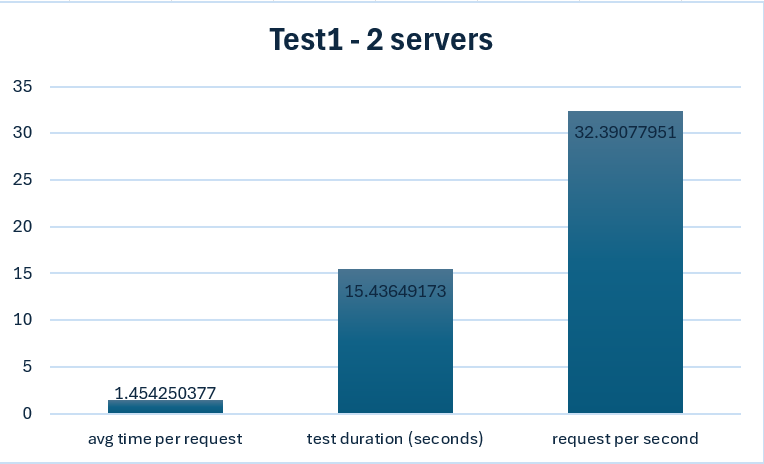
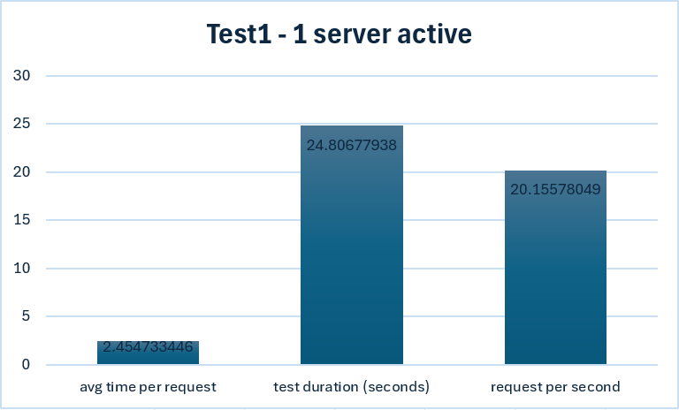
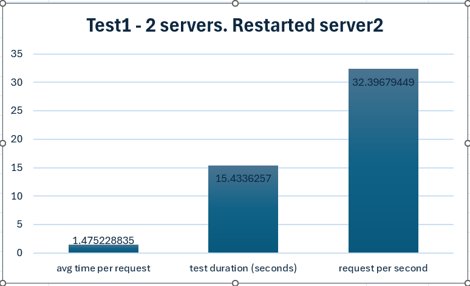
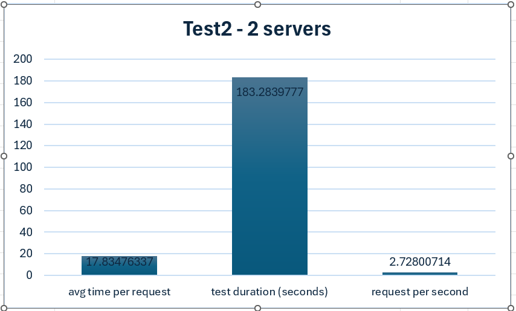
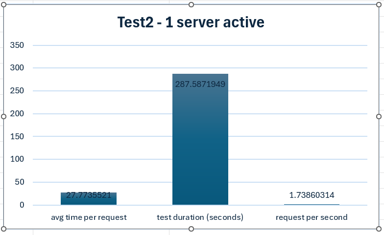
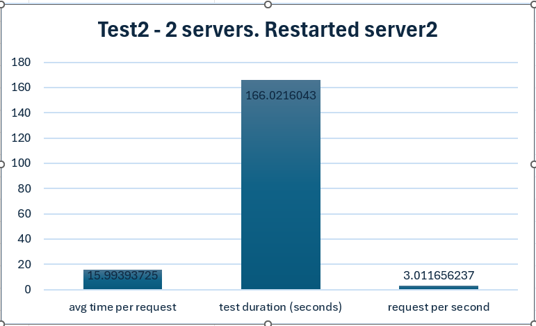

# Industry track
Janne Uutela  
Y63031163  

## Distributed calculations thing

## About the project
## Implemented components:
The loadbalancer:  
- Divides the incoming traffic to the actual active servers (a broker).  
- Client only needs to communicate with the loadbalancer.  
- Keeps track of the active servers. Healthchecks using client server communication.  
    - Separate thread performs the healthchecks on servers that have not received traffic in a certain time.  
    - Servers have a health_check endpoint for this.  
- One container serves as a loadbalancer.  
- If an error happens with the request, the errored server is turned to non active until the healthcheck confirms that the server is ok again or the server itself sends a server_up message. This only makes sense in demo situation. If this was a real application, it would need a more detailed setup,
when the traffic is guided elsewhere, not immeaditely when a first error of any kind appears.  
- Uses flask standard logging for received requests, which you can monitor when you have started the containers.  
    - You can also see the logs with command: docker logs containername

The servers:  
- Receives a request from a loadbalancer.  
- Once finished with the request, the response is returned to the loadbalancer and eventually to the client.  
- Has an endpoint for healthcheck for the loadbalancer to keep track which servers are on.  
- Has an endpoint for is_prime, for prime number checking. This could have been anything.  
- Two containers serve as the actual servers.  
    - named resources, server1, server2. For easy communication between the servers and loadbalancer.  
- Once server starts, it notifies the loadbalancer that it is on and ready to do some work.  
    - The loadbalancer has an "server_up" endpoint for this.  
        - the server sends its own address to this location. The loadbalancer uses this address to send requests and healthchecks  
- Uses flask standard logging for received requests, which you can monitor when you have started the containers.  

The client:  
- You can use postman or thunder client as a client for individual requests.  
    - http://127.0.0.1:9000/is_prime/524287  
- test_script.py created to simulate multiple clients, making lots of requests simultaneously  
    - Creates a number of threads accessing the loadbalancer  
    - Phase 1, all servers are on.  
    - Phase 2, server2 is stopped.  
        - e.g. simulate maintenance or error leading to crash  
        - healthcheck detects that server2 is not ok and the loadbalancer does not send traffic there.  
        - all traffic is sent to server1  
    - Phase 3, server2 is  started again.  
        - e.g. simulate recovering from error or end of maintenance  
        - Loadbalancer detects, using healthcheck, that the server is back on and guides traffic there again.  
        - both server1 and server2 receives traffic.  
    - a relatively fast is_prime calculation was chosen for the clients to spam the loadbalancer with  
        - checking a really large prime number will take a long time. Timeouting requests will fail and the server is set as non active.  

## Built with:
Built with python and flask. Besides the flask, you need also the requests library installed. Also docker is required.  

Requirements:  
- python  
- flask  
- requests  
- docker (desktop)  

## Getting Started:
Makefile created for ease of use. If you have "make" in your system, you can use these commands.  
(or just run the base commands that the make commands execute). Have your docker desktop running.

make build  
    - runs docker-compose build. Creates the containers  

make start  
    - runs docker-compose up. Starts the containers  

make test  
    - runs the test_script.py file  

## Results of the tests:
example output of running the test script:  
used a number 524287 in the requests, which is a relatively high prime number. It takes around 50 ms with my machine
running these containers to solve a single request.  
=================Starting the tests===============  
Phase 1 - Using 2 servers  
Creating 50 users threads. Each will do 10 requests  

Avg time per request:  1.4542503771781923  
Successful requests :  500  
Test took 15.43649172782898 seconds.  
Requests per second:  32.39077951232907  

  

====  

stopping server2  
server2  
Phase 2 - Repeating the test with only 1 server  
Creating 50 users threads. Each will do 10 requests  

Avg time per request:  2.454733446121216  
Successful requests :  500  
Test took 24.806779384613037 seconds.  
Requests per second:  20.15578049241395  

  

====

starting the server2 again  
server2  
Phase 3 - Back to 2 servers  
Creating 50 users threads. Each will do 10 requests  

Avg time per request:  1.475228834629059  
Successful requests :  500  
Test took 15.4336256980896 seconds.  
Requests per second:  32.396794491516715  

  

====

------------------------------ Second example  
second example with a bit higher prime number 6700417 (previous was 524287). This takes around 450ms for a single request.
I had to set the loadbalancer request timeout limit to unnaturally high (60 seconds) so that all the tests in the test script would succeed.
Probably better solution would be setting more servers for loadbalancer, if there indeed were a lot of requests that take this long.  

=================Starting the tests===============  
Phase 1 - Using 2 servers  
Creating 50 users threads. Each will do 10 requests  

Avg time per request:  17.83476336765289  
Successful requests :  500  
Test took 183.2839777469635 seconds.  
Requests per second:  2.728007140320172  

  

====

stopping server2  
server2  
Phase 2 - Repeating the test with only 1 server  
Creating 50 users threads. Each will do 10 requests  

Avg time per request:  27.773552101135255  
Successful requests :  500  
Test took 287.5871949195862 seconds.  
Requests per second:  1.7386031396140837  

  

====

starting the server2 again  
server2  
Phase 3 - Back to 2 servers  
Creating 50 users threads. Each will do 10 requests  

Avg time per request:  15.993937248229981  
Successful requests :  500  
Test took 166.0216042995453 seconds.  
Requests per second:  3.0116562366056443  

  

====

As long as the requests are cleared from the queue faster than the timeout limit is, the requests should succeed. 
If the clients manage to put more pending requests than the servers are able to clear, there will be connection errors and failed requests from the timeouts.
This could be solved in a few way. First, if these spikes of traffic are just temporary and happen occasionally, probably
most economic way would be to add a retry to the client side, with a short random wait period.  
If the high traffic is constant, more server instances should be deployed. This could be achieved by adding them in
the docker-compose file and rebuilding the system. The third way, which I used to quickly solve the request failing from the timeouts, is to 
raise the timeout limit. This how ever is not recommended to be raised as high as I did (60s). As it takes longer to know if something is wrong and
this could be used in denial of service attacks. Also the customer using this application would not be very happy if requests take closer to 60 seconds.  

One thing to notify is that even when I have made the loadbalancer to stop sending traffic to a server if a single request fails on any error.
This is only for demo purposes. If an on error traffic guiding was made to a real application, it would certainly need more detailed setup on
which error and how many instances of that error has happened in a certain timeframe to stop guiding the traffic to a certain server.  

The logs can be monitored from docker desktop, from terminal with docker logs containername. I have also captured the logs into logs folder.
You can capture new logs there by setting COPY_LOGS = True, to test_script.py and running the script again.  
